# Deploying Wazuh Single-Node (All-in-One) on Ubuntu

This is my write-up of deploying a full Wazuh stack — Indexer, Manager, Filebeat, and Dashboard — on a single Ubuntu 24.04 VM. I went with the official step-by-step installation method instead of the automated install script, mainly because I wanted to actually understand what each component needs and how they connect, rather than just running one script and hoping for the best.

Everything below is exactly what I ran, in the order I ran it, including a couple of mistakes I made along the way and how I fixed them.

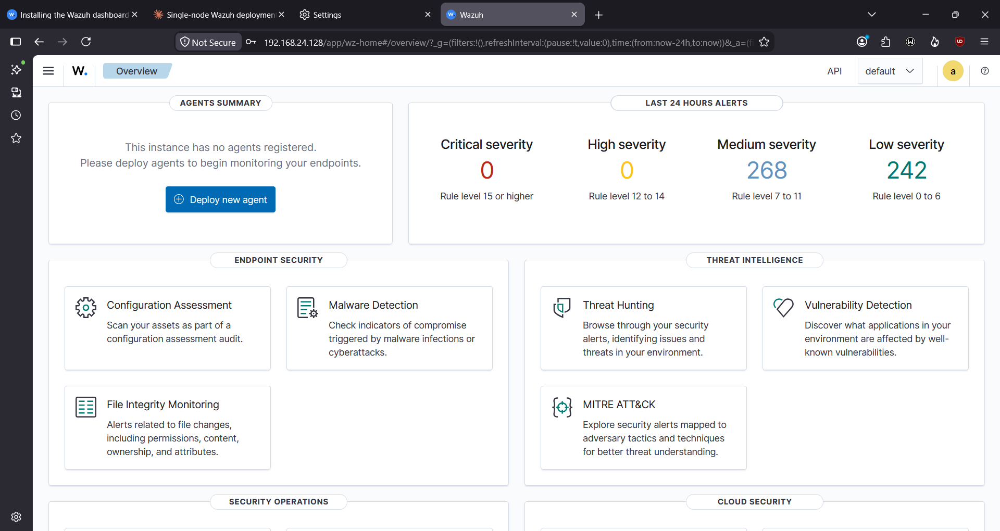

## Table of Contents

1. [Why I Set This Up](#why-i-set-this-up)
2. [What You'll Need](#what-youll-need)
3. [Step 1 — Generating Certificates](#step-1--generating-certificates)
4. [Step 2 — Adding the Wazuh Repository](#step-2--adding-the-wazuh-repository)
5. [Step 3 — Installing and Configuring the Indexer](#step-3--installing-and-configuring-the-indexer)
6. [Step 4 — Verifying the Indexer](#step-4--verifying-the-indexer)
7. [Step 5 — Installing the Manager and Filebeat](#step-5--installing-the-manager-and-filebeat)
8. [Step 6 — Connecting the Manager to the Indexer](#step-6--connecting-the-manager-to-the-indexer)
9. [Step 7 — Starting the Manager and Filebeat](#step-7--starting-the-manager-and-filebeat)
10. [Step 8 — Installing and Configuring the Dashboard](#step-8--installing-and-configuring-the-dashboard)
11. [Step 9 — Logging Into the Dashboard](#step-9--logging-into-the-dashboard)
12. [Step 10 — Rotating the Default Passwords](#step-10--rotating-the-default-passwords)
13. [Step 11 — Locking Down the Repository](#step-11--locking-down-the-repository)
14. [What I Learned / Things That Tripped Me Up](#what-i-learned--things-that-tripped-me-up)
15. [A Quick Disclaimer](#a-quick-disclaimer)

---

## Why I Set This Up

Wazuh is an open-source SIEM/XDR platform, and I wanted hands-on experience deploying it properly rather than just reading about it. Since this was a learning/lab environment, I put everything on one VM instead of spreading it across multiple nodes:

- **Wazuh Indexer** (built on OpenSearch) — stores and indexes all the alerts and events
- **Wazuh Manager** — collects data from agents, analyzes it, and generates alerts
- **Filebeat** — ships alerts securely from the manager over to the indexer
- **Wazuh Dashboard** — the web UI where you actually look at everything

### How it's laid out

```
┌─────────────────────────────────────────────┐
│                Single VM                     │
│                                               │
│  ┌────────────────┐      ┌────────────────┐ │
│  │  Wazuh Manager │─────▶│  Filebeat      │ │
│  └────────────────┘      └───────┬────────┘ │
│                                   │           │
│                                   ▼           │
│                          ┌────────────────┐  │
│                          │ Wazuh Indexer  │  │
│                          └───────┬────────┘  │
│                                   │           │
│                                   ▼           │
│                          ┌────────────────┐  │
│                          │ Wazuh Dashboard│  │
│                          └────────────────┘  │
└─────────────────────────────────────────────┘
```

Since every component lives on the same box, I had everything talk to each other over `127.0.0.1` rather than the VM's actual network IP. All of that traffic is encrypted with self-signed certs I generated using Wazuh's own cert tool.

## What You'll Need

| Item | What I used |
|---|---|
| OS | Ubuntu 24.04 (Noble) |
| Wazuh version | 4.14.7 |
| Access | Root / sudo |
| Specs | 4 vCPU, 8 GB RAM — enough for a lab setup, though I'd size up for anything real |

---

## Step 1 — Generating Certificates

First thing I did was grab the certificate tool and the config template:

```bash
curl -sO https://packages.wazuh.com/4.14/wazuh-certs-tool.sh
curl -sO https://packages.wazuh.com/4.14/config.yml
nano ./config.yml
```

Since I was doing an all-in-one setup, I pointed every node in `config.yml` — indexer, server, and dashboard — at `127.0.0.1`. This is actually what Wazuh's own docs recommend for single-host deployments (I initially used my VM's real IP instead, which also works, but switched to `127.0.0.1` to match the official guidance more closely):

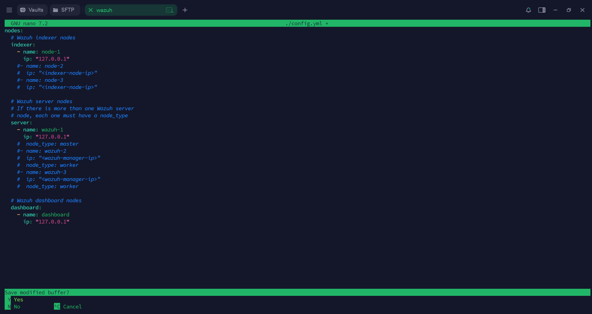

```yaml
nodes:
  indexer:
    - name: node-1
      ip: "127.0.0.1"
  server:
    - name: wazuh-1
      ip: "127.0.0.1"
  dashboard:
    - name: dashboard
      ip: "127.0.0.1"
```

With that saved, I generated the certs:

```bash
bash ./wazuh-certs-tool.sh -A
```

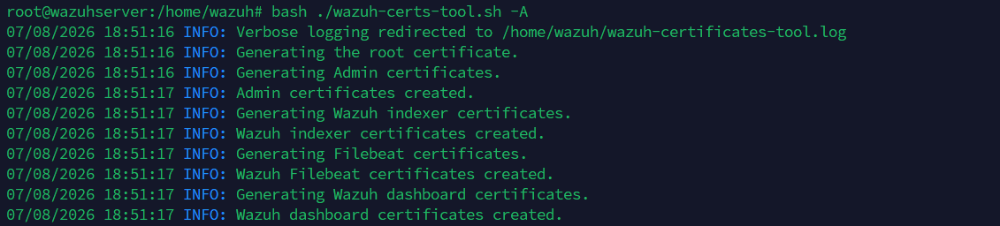

Good sign — root CA, admin, indexer, Filebeat, and dashboard certs all came back created. I archived them so I could deploy them to each component as I went:

```bash
tar -cvf ./wazuh-certificates.tar -C ./wazuh-certificates/ .
```

Inside that archive: `root-ca.pem` / `root-ca.key`, `admin.pem` / `admin-key.pem`, `node-1.pem` / `node-1-key.pem` (for the indexer), `wazuh-1.pem` / `wazuh-1-key.pem` (for the server/Filebeat), and `dashboard.pem` / `dashboard-key.pem`.

---

## Step 2 — Adding the Wazuh Repository

Standard repo setup before installing anything:

```bash
apt-get install debconf adduser procps
apt-get install gnupg apt-transport-https

curl -s https://packages.wazuh.com/key/GPG-KEY-WAZUH | \
  gpg --no-default-keyring --keyring gnupg-ring:/usr/share/keyrings/wazuh.gpg --import
chmod 644 /usr/share/keyrings/wazuh.gpg

echo "deb [signed-by=/usr/share/keyrings/wazuh.gpg] https://packages.wazuh.com/4.x/apt/ stable main" \
  | tee -a /etc/apt/sources.list.d/wazuh.list

apt-get update
```

---

## Step 3 — Installing and Configuring the Indexer

```bash
apt-get -y install wazuh-indexer
```

Then I opened up `/etc/wazuh-indexer/opensearch.yml` and made sure it was set up correctly for a single node — `node.name` set to `node-1`, only `node-1` under `cluster.initial_master_nodes`, `discovery.seed_hosts` left commented out (that setting's only needed once you have more than one node), and only the `node-1` entry active under `plugins.security.nodes_dn`:

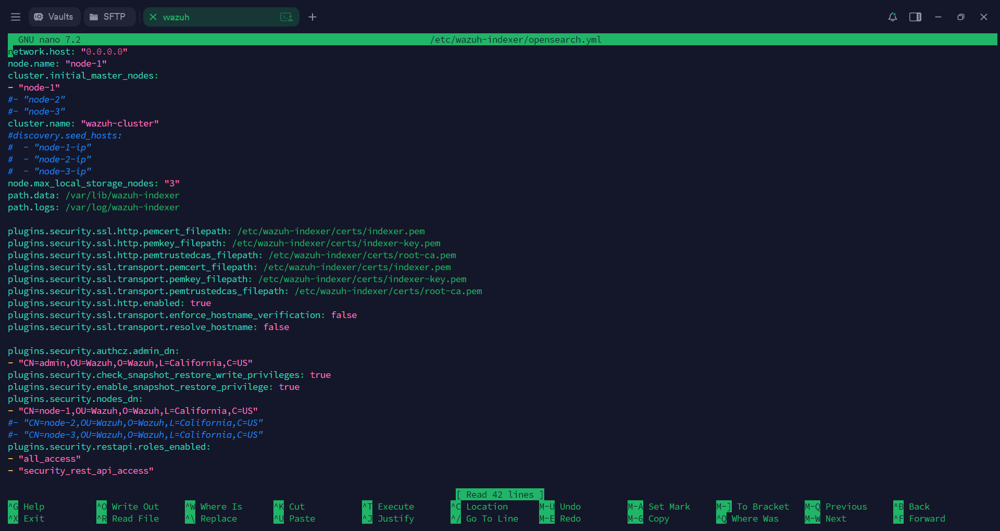
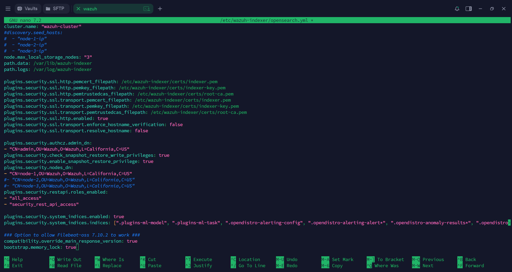

```bash
nano /etc/wazuh-indexer/opensearch.yml
```

Next, I deployed the certs I'd generated earlier:

```bash
NODE_NAME=node-1
mkdir /etc/wazuh-indexer/certs
tar -xf ./wazuh-certificates.tar -C /etc/wazuh-indexer/certs/ \
  ./$NODE_NAME.pem ./$NODE_NAME-key.pem ./admin.pem ./admin-key.pem ./root-ca.pem
mv -n /etc/wazuh-indexer/certs/$NODE_NAME.pem /etc/wazuh-indexer/certs/indexer.pem
mv -n /etc/wazuh-indexer/certs/$NODE_NAME-key.pem /etc/wazuh-indexer/certs/indexer-key.pem
chmod 500 /etc/wazuh-indexer/certs
chmod 400 /etc/wazuh-indexer/certs/*
chown -R wazuh-indexer:wazuh-indexer /etc/wazuh-indexer/certs
```

And started it up:

```bash
systemctl daemon-reload
systemctl enable wazuh-indexer
systemctl start wazuh-indexer
```

Since this was the first time bringing the indexer online, I had to initialize its security plugin (only needs to happen once, on a single-node setup):

```bash
/usr/share/wazuh-indexer/bin/indexer-security-init.sh
```

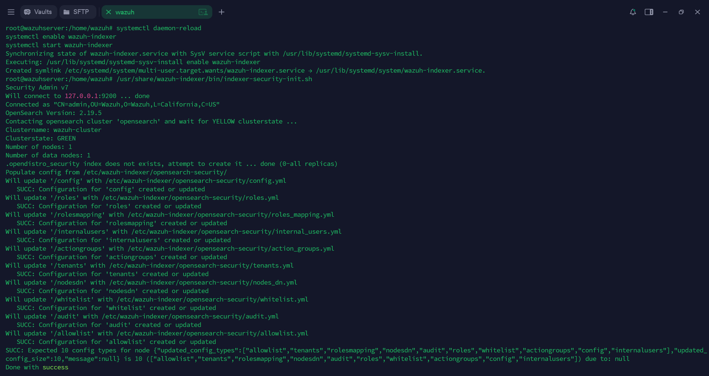

Clusterstate came back GREEN with one node — exactly what I wanted to see at this point.

I also wanted the indexer's JVM to lock its memory rather than risk getting swapped out, so I set that up and adjusted the heap size to something sensible for my VM's RAM:

```bash
mkdir -p /etc/systemd/system/wazuh-indexer.service.d/
cat > /etc/systemd/system/wazuh-indexer.service.d/wazuh-indexer.conf << EOF
[Service]
LimitMEMLOCK=infinity
EOF

nano /etc/wazuh-indexer/jvm.options
```

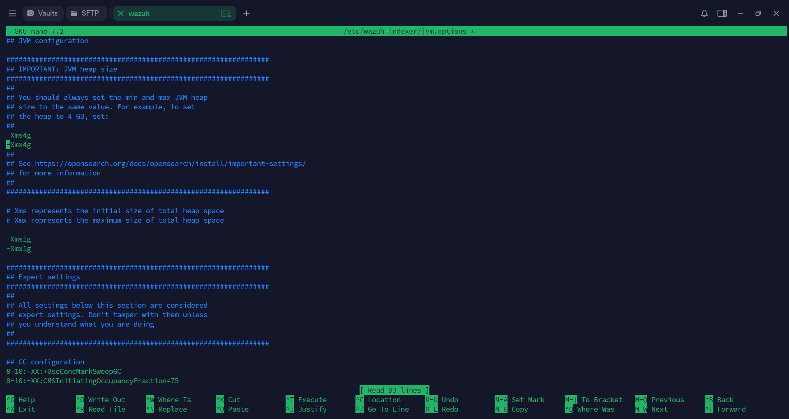

```bash
systemctl daemon-reload
systemctl restart wazuh-indexer
```

Then I confirmed the memory lock actually took:

```bash
curl -k -u admin:admin "https://127.0.0.1:9200/_nodes?filter_path=**.mlockall&pretty"
```

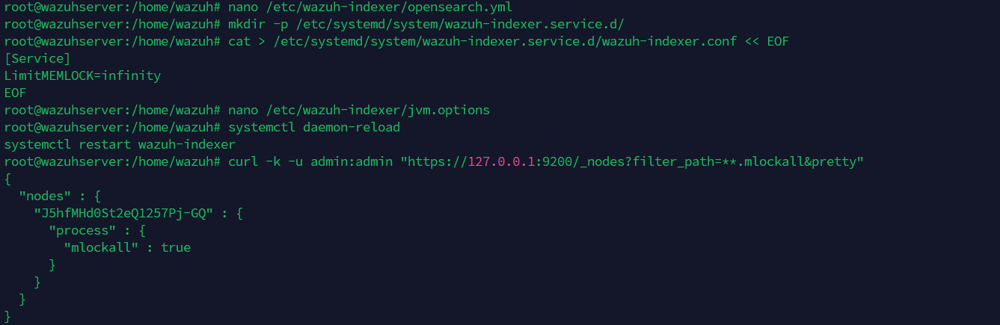

`"mlockall": true` — good, that meant the JVM wasn't going to get swapped.

---

## Step 4 — Verifying the Indexer

Before moving any further, I wanted to be sure the indexer was actually healthy:

```bash
curl -k -u admin https://127.0.0.1:9200
curl -k -u admin https://127.0.0.1:9200/_cat/nodes?v
```

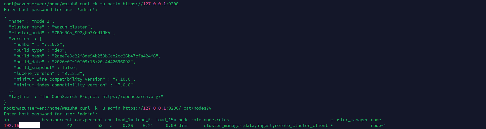

Got back the cluster info and a single healthy node in `_cat/nodes` — that told me I was safe to move on to the manager.

---

## Step 5 — Installing the Manager and Filebeat

```bash
apt-get -y install wazuh-manager
apt-get -y install filebeat
curl -so /etc/filebeat/filebeat.yml https://packages.wazuh.com/4.14/tpl/wazuh/filebeat/filebeat.yml
```

One thing I almost second-guessed myself on: Filebeat's default `output.elasticsearch.hosts` is already set to `127.0.0.1:9200`, and since the indexer's running on the same VM, I left it exactly as-is — no need to touch it for an all-in-one setup.

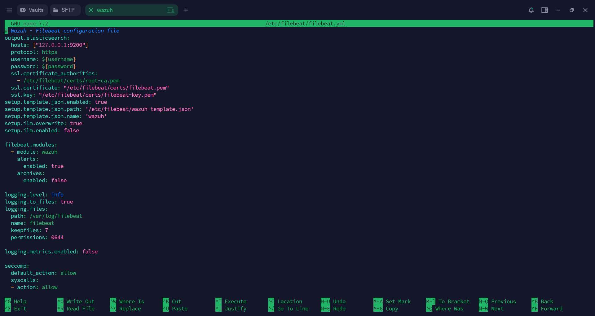

```bash
nano /etc/filebeat/filebeat.yml
```

I stored the indexer credentials in Filebeat's keystore rather than hardcoding them into the config file:

```bash
filebeat keystore create
echo admin | filebeat keystore add username --stdin --force
echo admin | filebeat keystore add password --stdin --force
```

Then pulled in the Wazuh alert template and the module itself:

```bash
curl -so /etc/filebeat/wazuh-template.json \
  https://raw.githubusercontent.com/wazuh/wazuh/v4.14.7/extensions/elasticsearch/7.x/wazuh-template.json
chmod go+r /etc/filebeat/wazuh-template.json

curl -s https://packages.wazuh.com/4.x/filebeat/wazuh-filebeat-0.5.tar.gz | \
  tar -xvz -C /usr/share/filebeat/module
```

One detail that caught me off guard: Filebeat's certs are generated under the **server** node's name (`wazuh-1`), not something Filebeat-specific. I had to rename them after extracting:

```bash
NODE_NAME=wazuh-1
mkdir /etc/filebeat/certs
tar -xf ./wazuh-certificates.tar -C /etc/filebeat/certs/ \
  ./$NODE_NAME.pem ./$NODE_NAME-key.pem ./root-ca.pem
mv -n /etc/filebeat/certs/$NODE_NAME.pem /etc/filebeat/certs/filebeat.pem
mv -n /etc/filebeat/certs/$NODE_NAME-key.pem /etc/filebeat/certs/filebeat-key.pem
chmod 500 /etc/filebeat/certs
chmod 400 /etc/filebeat/certs/*
chown -R root:root /etc/filebeat/certs
```

---

## Step 6 — Connecting the Manager to the Indexer

I stored the indexer credentials in the manager's own keystore too — this one's specifically needed for the vulnerability detection module:

```bash
echo 'admin' | /var/ossec/bin/wazuh-keystore -f indexer -k username
echo 'admin' | /var/ossec/bin/wazuh-keystore -f indexer -k password
```

Then I edited `ossec.conf`'s `<indexer>` block to point at the indexer over HTTPS. Small mistake I made the first time around: I had this set to `0.0.0.0`, copied over from the indexer's bind address — but `0.0.0.0` only makes sense as something to *listen* on, not something to *connect to*. Fixed it to `127.0.0.1`, matching everywhere else:

```bash
nano /var/ossec/etc/ossec.conf
```

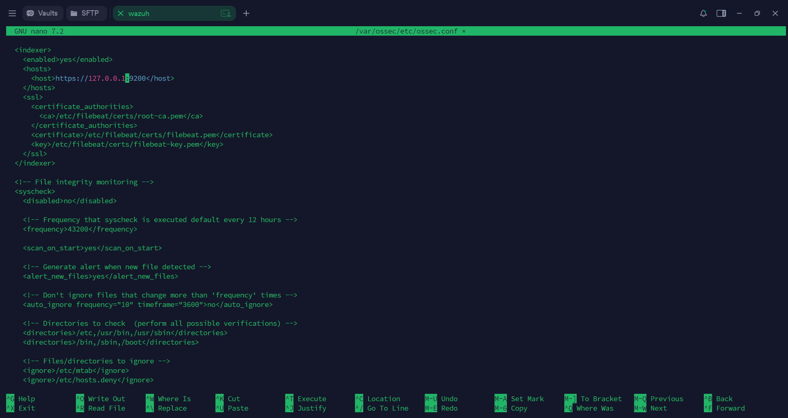

```xml
<indexer>
  <enabled>yes</enabled>
  <hosts>
    <host>https://127.0.0.1:9200</host>
  </hosts>
  <ssl>
    <certificate_authorities>
      <ca>/etc/filebeat/certs/root-ca.pem</ca>
    </certificate_authorities>
    <certificate>/etc/filebeat/certs/filebeat.pem</certificate>
    <key>/etc/filebeat/certs/filebeat-key.pem</key>
  </ssl>
</indexer>
```

---

## Step 7 — Starting the Manager and Filebeat

```bash
systemctl daemon-reload
systemctl enable wazuh-manager
systemctl start wazuh-manager
systemctl status wazuh-manager
```

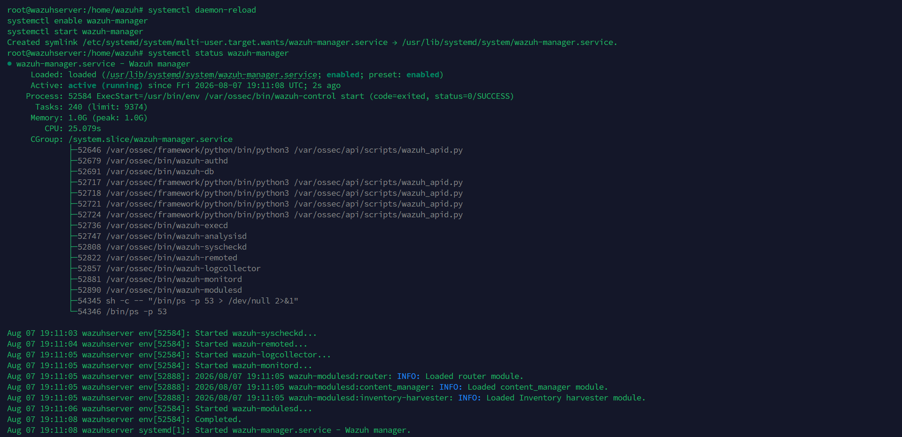

Everything came up green — `active (running)`, with all the sub-processes (analysisd, remoted, syscheckd, and so on) started cleanly.

```bash
systemctl daemon-reload
systemctl enable filebeat
systemctl start filebeat
filebeat test output
```

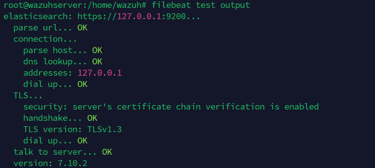

This was the check I cared about most at this stage — TLS handshake OK, TLSv1.3, and "talk to server... OK." That confirmed Filebeat could actually reach and authenticate to the indexer.

---

## Step 8 — Installing and Configuring the Dashboard

```bash
apt-get install debhelper tar curl libcap2-bin
apt-get -y install wazuh-dashboard
```

I edited `/etc/wazuh-dashboard/opensearch_dashboards.yml` to point `opensearch.hosts` at the local indexer over `localhost:9200`, bound `server.host` to `0.0.0.0` so I could actually reach the dashboard UI from my browser (not just from inside the VM), and pointed it at the dashboard's own certs:

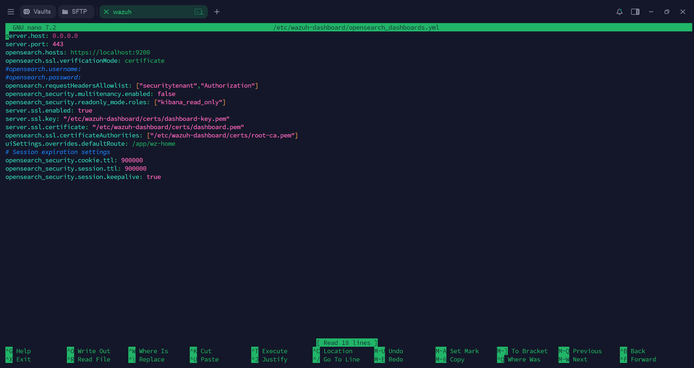

```bash
nano /etc/wazuh-dashboard/opensearch_dashboards.yml
```

Deployed the dashboard's certs and brought the service up:

```bash
NODE_NAME=dashboard
mkdir /etc/wazuh-dashboard/certs
tar -xf ./wazuh-certificates.tar -C /etc/wazuh-dashboard/certs/ \
  ./$NODE_NAME.pem ./$NODE_NAME-key.pem ./root-ca.pem
[ ! -e /etc/wazuh-dashboard/certs/dashboard.pem ] && \
  mv -n /etc/wazuh-dashboard/certs/$NODE_NAME.pem /etc/wazuh-dashboard/certs/dashboard.pem
[ ! -e /etc/wazuh-dashboard/certs/dashboard-key.pem ] && \
  mv -n /etc/wazuh-dashboard/certs/$NODE_NAME-key.pem /etc/wazuh-dashboard/certs/dashboard-key.pem
chmod 500 /etc/wazuh-dashboard/certs
chmod 400 /etc/wazuh-dashboard/certs/*
chown -R wazuh-dashboard:wazuh-dashboard /etc/wazuh-dashboard/certs

systemctl daemon-reload
systemctl enable wazuh-dashboard
systemctl start wazuh-dashboard
```

Last thing before logging in — I checked the dashboard's connection to the Wazuh Manager's API, which uses the `wazuh-wui` user on port `55000`:

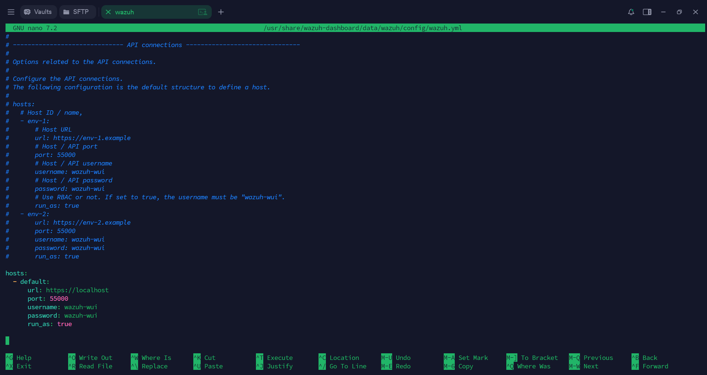

```bash
nano /usr/share/wazuh-dashboard/data/wazuh/config/wazuh.yml
```

---

## Step 9 — Logging Into the Dashboard

With everything running, I opened a browser and went to `https://<my-VM-IP>`, and logged in with the `admin` indexer credentials.


At this point I had zero agents registered, which is expected since I hadn't deployed any yet, but the rule-severity numbers on the "Last 24 Hours Alerts" panel were already populating, and every module — Configuration Assessment, Malware Detection, Threat Hunting, Vulnerability Detection, File Integrity Monitoring, MITRE ATT&CK — was visible and clickable. That was my sign the whole stack was actually talking to itself correctly.

---

## Step 10 — Rotating the Default Passwords

Before calling this done, I rotated the default indexer and API passwords instead of leaving `admin`/`admin` in place:

```bash
/usr/share/wazuh-indexer/plugins/opensearch-security/tools/wazuh-passwords-tool.sh \
  --api --change-all --admin-user wazuh --admin-password wazuh
```

This generated new passwords for all the internal indexer users (`admin`, `kibanaserver`, `readall`, and so on) plus the Wazuh API users (`wazuh`, `wazuh-wui`). It automatically updated Filebeat's keystore and the dashboard's `wazuh-wui` user for me — but I noticed afterward it did **not** update the manager's own `wazuh-keystore` entry for the indexer. I had to go back and re-run the Step 6 keystore commands with the new password, then restart the manager. More on that below.

---

## Step 11 — Locking Down the Repository

Last step — I disabled the Wazuh package repo so I wouldn't accidentally pull in an upgrade that breaks compatibility between components:

```bash
sed -i "s/^deb /#deb /" /etc/apt/sources.list.d/wazuh.list
apt update
```

---

## What I Learned / Things That Tripped Me Up

A few things I ran into that I think are worth writing down, mostly so future-me (or anyone else following along) doesn't repeat them:

- **`0.0.0.0` is not a valid host to connect to.** I made this mistake in `ossec.conf` — copied `0.0.0.0` over from the indexer's `network.host` setting without thinking about it, and it happened to sort of work anyway because of how Linux resolves loopback connections, but it's not something to rely on. `0.0.0.0` is for *listening*, not *connecting*. I fixed it to `127.0.0.1` to match everything else in the all-in-one setup.
- **Rotating passwords doesn't touch every place they're stored.** `wazuh-passwords-tool.sh --change-all` updates Filebeat's keystore and the dashboard's `wazuh-wui` user automatically, but it skips the manager's own `wazuh-keystore` entry for the indexer (which the vulnerability detection module relies on). I had to update that one by hand and restart the manager — easy to miss.
- **Keep every IP consistent.** For an all-in-one deployment, every host/IP setting across `config.yml`, `opensearch.yml`, `filebeat.yml`, `ossec.conf`, and `opensearch_dashboards.yml` needs to point at the same address. I used `127.0.0.1` everywhere, which is also what Wazuh's docs recommend for single-host setups.
- **Cert filenames follow the node names in `config.yml`, not the component names.** So the certs meant for Filebeat come out named after the server node (`wazuh-1`), and I had to manually rename them to `filebeat.pem` / `filebeat-key.pem`. Same idea for the dashboard and indexer certs.
- **`filebeat test output` and `_cat/nodes?v` are the two fastest sanity checks.** Whenever something felt off, running those two commands told me almost immediately whether the problem was TLS-related or the indexer itself.
- **Set the JVM heap explicitly.** I didn't want to leave the indexer on tiny default heap values, so I set `-Xms`/`-Xmx` to match roughly half my VM's available RAM.

## A Quick Disclaimer

This was a personal lab/learning setup — self-signed certs, no production hardening. Any IPs or credentials shown here are either loopback addresses or already rotated, so nothing here reflects an actual live environment.

## References

- [Wazuh Official Documentation](https://documentation.wazuh.com/current/)
- [Wazuh Quickstart Guide](https://documentation.wazuh.com/current/quickstart.html)
